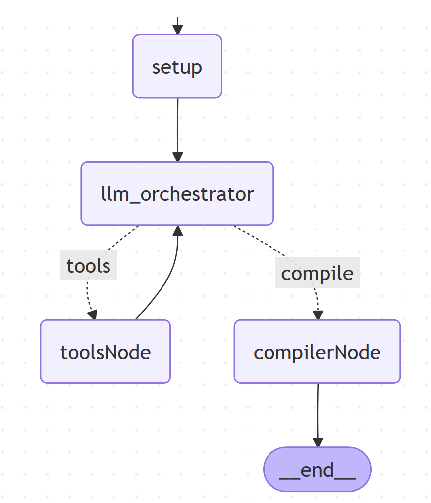

# Documentation Graph (Dataset Focus)

Questo progetto dimostra come costruire un grafo con **LangGraph** per generare documentazione tecnica a partire da un repository AI/ML.  
Al momento il focus è sulla sezione **Dataset Documentation**, ma l’architettura è pensata per estendersi facilmente anche a **Model** e **Application Documentation**.

---

## 🗺️ schema del grafo


Flusso: setup → llm_orchestrator → (tools?|compile) → toolsNode ↔ llm_orchestrator … → compilerNode → END

llm_orchestrator: orchestration LLM + tool use

toolsNode: esegue i tool (in questo setup: ask_user_input, clone_repo)

compilerNode: finalizer che compila i metadati in output strutturato e li salva nello state

## 📂 Struttura del progetto

```text
project/
|-- states.py        # definizione dello stato
|-- nodes.py         # nodi
|-- tools.py         # tool disponibili 
|-- graph.py         # costruzione del grafo 
|-- main.py          # entry-point: esegue il grafo e stampa risultati
|-- images/         # immagini per il README 
```


---

## ⚙️ Componenti

### `states.py`
Definisce lo **stato globale** del grafo:
- `Config`: configurazione iniziale (repo di origine, documenti da generare).
- `DatasetMeta`: metadati del dataset secondo il template.
- `State`: combinazione di `Config` + `DatasetMeta` + '`messages`.

### `nodes.py`
- `init_config`: inizializza lo state.
- `simple_llm_node` (llm_orchestrator): binda i tool (ask_user_input, clone_repo), ragiona e decide se invocare tool (emettendo tool_calls).
- `compile_artifacts_node` (compilerNode): usa structured output (Pydantic v2) per compilare tutti i campi del dataset solo dalle informazioni emerse in chat/tool; mappa version/status in version_and_status.

### `tools.py`
Contiene **funzioni riutilizzabili** di supporto ai nodi, come:
- `ask_user_input`: chiede input dall' utente via console (CLI)
- `clone repo`:clona la repository localmente


### `graph.py`
Costruisce il **grafo LangGraph**:
- definisce i nodi,
- stabilisce le connessioni (`edges`),
- restituisce il grafo compilato pronto all’esecuzione.

### `main.py`
È l’**entrypoint** del progetto:
- costruisce il grafo tramite `graph.build_graph()`,
- crea uno stato iniziale,
- invoca il grafo,
- stampa il risultato finale.

---

## ▶️ Esecuzione

### Prerequisiti

- python 3.11 +
- git installato
- chiave API del provider LLM(Anthropic)

### Installazione 
1. Installa i requisiti (serve [LangGraph](https://python.langchain.com/docs/langgraph/)):
   ```bash
   pip install langgraph langchain langchain-anthropic pydantic

### Avvio
  
 ```bash
   python main.py
 
```
Se non c’è un URL GitHub valido nello state, l’LLM chiamerà ask_user_input e la CLI te lo chiederà.


