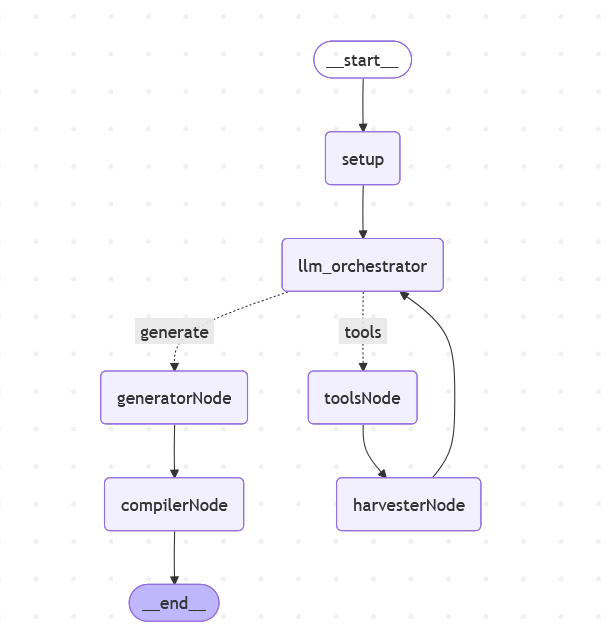
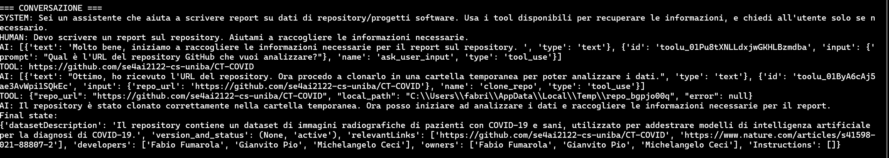

# Documentation Graph (Dataset Focus)

Questo progetto dimostra come costruire un grafo con **LangGraph** per generare documentazione tecnica a partire da un repository AI/ML.  
Al momento il focus è sul documento **Dataset Documentation**, ma l’architettura è pensata per estendersi facilmente per integrare nuovi documenti regolatori, come **Model Documentation** e **Application Documentation**.
Attualmente, l’esecuzione può essere lanciata direttamente dal `main` passando il link del repository da documentare; in futuro potrà essere attivata da workflow CI/CD (es. su pull request).

---

## 🗺️ schema del grafo


- **setup node**: inizializza e istanzia alcune variabili necessarie per il flow designato( es. state[config],state[dataset]....)

- **llm_orchestrator**: LLM orchestrator con tool binding ; decide il routing nel grafo

- **toolsNode**: esegue i tool definiti (es. @tool clone_repo)

- **harvesterNode**: colleziona tutti i risultati dei tool node e gli assegna alle corrispettive variaibli dello state

- **generator node**: riformula/compone i campi del dataset usando **solo** frammenti presenti nello state(scope chiuso)

- **compilerNode**: finalizza i contenuti e produce documenti formattati tramite template **Jinja2** 

## 📂 Struttura del progetto

```text
project/
|-- states.py        # definizione dello stato
|-- nodes.py         # implementazione dei nodi
|-- tools.py         # tool disponibili 
|-- graph.py         # costruzione del grafo 
|-- main.py          # entry-point: esegue il grafo e stampa risultati
|-- README.md        
|-- images/          # immagini per il README 
|-- templates/       # directory template da generare
|-- renderedDocs/    # directory documenti renderizzati e finali
```


---

## ⚙️ Componenti

### `states.py`
Definisce lo **stato globale** del grafo:
- `Config`: configurazione iniziale (chiave LLM, repository sorgente, documenti da generare).
- `DatasetMeta`: metadati del dataset usati dai template.
- `State`: combinazione di `Config` + `DatasetMeta` + '`messages`.

### `nodes.py`
- `init_config`: inizializza lo state.
- `llm_orchestrator`: binda i tool ( clone_repo,detectDatasetOwners,detectDatasetStatus,...) e decide se invocare tool (emettendo *tool_calls*) o passare al generator.
- `harvester_tool_results`(harvesterNode): consolida i risultati dei tool nello state
- `generate_contents` (generatorNode): riformula/compone i campi del dataset usando **solo** i frammenti nello state
- `compile_artifacts_node` (compilerNode): renderizza i template **Jinja2** per produrre i documenti finali in `renderedDocs/` (Pydantic v2) per compilare tutti i campi del dataset solo dalle informazioni emerse in chat/tool; mappa version/status in version_and_status.

### `tools.py`
Contiene **funzioni riutilizzabili** di supporto ai nodi, come:
- `ask_user_input`: chiede input dall' utente via console (CLI)
- `clone repo`:clona la repository localmente
- `description`:
- `detectDatasetOwners`:
- `detectDatasetStatus`:


### `graph.py`
Costruisce il **grafo LangGraph**:
- definisce i nodi,
- stabilisce le connessioni (`edges`),
-implementa il **router condizionale** ((tool-calls → `toolsNode`, altrimenti → `generator` → `compiler`)),
- restituisce il grafo compilato pronto all’esecuzione.

### `main.py`
È l’**entrypoint** del progetto:
- costruisce il grafo tramite `graph.build_graph()`,
- crea lo stato iniziale,
- invoca il grafo,
- stampa il risultato finale.

---

## ▶️ Esecuzione

### Prerequisiti
- Python 3.11+
- `git` installato
- Chiave API **Anthropic** (esposta come `ANTHROPIC_API_KEY` **oppure** impostata in `config["llm_api_key"]`).

### Installazione 
1. Installa i requisiti:

```bash
pip install -r requirements.txt

### Avvio
  
 ```bash
   python main.py
 
```





