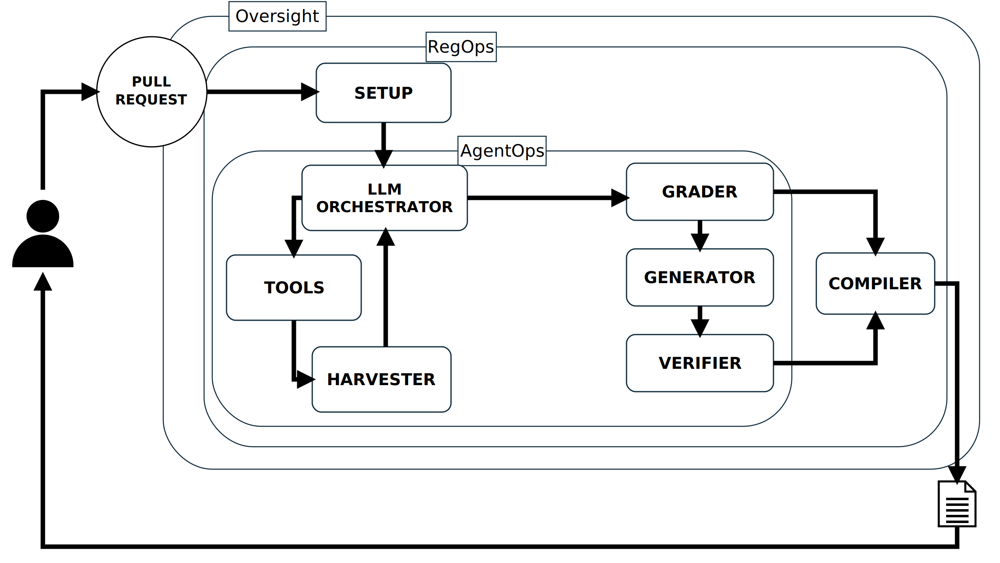

# LLMAutodoc — Agentic framework for regulatory data documentation (EU AI Act, Art. 10)

Generates the **Data Documentation** document (AI Act Art. 10 / Art. 11, Annex IV) from an AI/ML
repository. Guiding principle: **every field states how it was obtained, and a field without
evidence is declared as such, not invented.**


## Architecture




The Orchestrator → Tools → Harvester → Orchestrator loop is iterative (several turns, until the
orchestrator answers DONE). Grader, Generator and Verifier are traversed once and iterate internally
over the retrieval fields; the Compiler is the last node and renders the document from the Jinja2
template.

| node | file | what it does |
|---|---|---|
| **SETUP** | `nodes.py` | configuration, repository clone, field initialisation from the field spec |
| **LLM ORCHESTRATOR** | `agent.py` | LLM with the tools bound: reads the field spec and decides which tools to call to collect evidence (ReAct); when it is done it guarantees coverage of any remaining field (tracked fallback) |
| **TOOLS** | `tools/deterministic.py`, `tools/retrieval.py` | what the Orchestrator can call: `extract_<field>` (18 deterministic extractors) and `retrieve_evidence` (BM25 over the closed repository corpus) |
| **HARVESTER** | `agent.py` | consolidates the tool results into the shared state |
| **GRADER** | `nodes.py`, `llm.py` | Corrective RAG: judges the evidence of each retrieval field — `CORRECT` / `AMBIGUOUS` / `INCORRECT` → **abstention**. Can be disabled (`grade: false`) to obtain plain RAG |
| **GENERATOR** | `nodes.py`, `llm.py` | writes the text using only the relevant chunks, with `[n]` citations |
| **VERIFIER** | `nodes.py`, `llm.py` | sentence-by-sentence faithfulness check; on failure → abstention |
| **COMPILER** | `nodes.py` | Jinja2 rendering (`templates/data.j2`) + `audit.json` (per-field evidence and trace) |

### One strategy per field (`field_spec.py`)

| strategy | nature of the field | how it is filled | LLM in the value |
|---|---|---|---|
| `tool` | observable fact (git, DVC, LICENSE, dvc.yaml, source code) | deterministic extractor with provenance | no |
| `retrieval` | discursive information (README, PDF report, notebooks, docstrings) | retrieve → grader → generator → verifier | yes |
| `human` | judgement / organisational information | never filled: *requires human input* | no |

The field spec **constrains** the orchestrator (for each field it states which strategy is allowed)
but does not replace it: the model chooses which tools to call and in which order.

### Two routing modes

- `--routing agentic` (default): the LLM Orchestrator selects the tools (figure above).
- `--routing declarative` (baseline): the same tools executed in field-spec order, with no LLM in the
  orchestration. Used as a comparison in the evaluation.

Possible per-field outcomes: `filled`, `partial`, `abstained`, `not_observable`, `human_required`.

## Configuration

All parameters live in **`config.yaml`** (models, routing, top_k, verifier, directories, and the
`experiments` section with the repositories and the number of runs). `config.py` turns it into the
dictionary that enters the graph; the command line only overrides a value or points to another file.
Every `audit.json` records the configuration used: the run is reproducible.

### Three model roles

The three components that call a model are configured independently, so that the model which
writes a field and the model which checks it may belong to different families:

| key | component | default |
|---|---|---|
| `llm.model` | Orchestrator and Generator | `claude-sonnet-4-6` |
| `llm.grader_model` | Grader (evidence sufficiency) | `claude-haiku-4-5-20251001` |
| `llm.verifier_model` | Verifier (faithfulness) | empty = same as the grader |

A model outside Anthropic is written `<endpoint>:<model id>`, e.g. `gemini:gemini-3.5-flash-lite`,
where the endpoint is declared under `llm.endpoints` (an OpenAI-compatible `base_url` and the
**name** of the environment variable holding its key). Keys never appear in the file: Anthropic
reads `ANTHROPIC_API_KEY`, every other endpoint reads the variable it declares.

## Running

```bash
pip install -r requirements.txt
export ANTHROPIC_API_KEY=sk-ant-...          # Windows cmd: set ANTHROPIC_API_KEY=sk-ant-...
export GEMINI_API_KEY=AIza...                # only for runs that use a gemini: model

# a single run
python main.py https://github.com/se4ai2122-cs-uniba/CT-COVID.git --out renderedDocs/ct-covid
python main.py <repo> --routing declarative  # override: baseline
python main.py <repo> --config other.yaml    # alternative configuration file
python main.py <repo> --dry-run              # no LLM (extractors + heuristics only)
python main.py <repo> --no-grade             # ablation: plain RAG, no grader, no abstention
python main.py <repo> --no-verify            # ablation: without the verifier
python main.py <repo> --infer-strategy       # ablation: the Orchestrator is not told which instrument fits each field
python main.py <repo> --verifier gemini:gemini-3.5-flash-lite      # cross-family check: Claude writes, Gemini verifies
python main.py <repo> --model gemini:gemini-3.5-flash-lite --grader gemini:gemini-3.5-flash-lite \
                      --verifier claude-haiku-4-5-20251001         # the symmetric configuration
python main.py <repo> --mermaid              # print the graph

# the experiments of Chapter 5 (repo x variant x run, from the config)
python run_experiments.py                    # runs everything and writes renderedDocs/summary.csv
python run_experiments.py --only ct-covid --runs 1
python run_experiments.py --summarize-only   # rebuilds summary.csv from the existing runs
```

Output of a run: `renderedDocs/<name>/data.md` (the document), `audit.json` (audit trail: status,
evidence, verdicts, trace, which component covered each field, configuration) and, when a ground
truth exists, `evaluation.json`. `summary.csv` collects the metrics of all runs with mean and
standard deviation per configuration.

## Running in a container

```bash
docker build -t llmautodoc .
docker run --rm -e ANTHROPIC_API_KEY -v "$PWD/renderedDocs:/app/renderedDocs" \
    llmautodoc https://github.com/se4ai2122-cs-uniba/CT-COVID.git --out renderedDocs/ct-covid
```

Any `main.py` argument goes after the image name. Keys are passed at run time with `-e` and are
never baked into the image; `renderedDocs/` is mounted so the outputs land on the host. To run
the experiment campaign instead, override the entry point:
`--entrypoint python llmautodoc run_experiments.py --only ct-covid --runs 2`.

## Running inside a pipeline

`examples/regulatory-docs.yml` is a GitHub Actions workflow to be placed in the repository to be
documented, at `.github/workflows/`. On every pull request it regenerates the Data Documentation
from the branch under review and commits the document and its audit trail back to that branch,
so that the documentation travels with the change that caused it. It requires an
`ANTHROPIC_API_KEY` repository secret and the name of this repository in `LLMAUTODOC_REPO`.
Pull requests opened from a fork are skipped, since they have no write access.

## Reproducing the evaluation

The campaign covers the variants declared in `config.yaml`; the cross-family configurations are
launched by hand because they change the model of a single role.

```bash
set ANTHROPIC_API_KEY=sk-ant-...
set GEMINI_API_KEY=AIza...

# 1. the ablation ladder: full, no-verify, infer-strategy, no-grade (2 runs each) + dry-run
python run_experiments.py --only ct-covid --runs 2

# 2. cross-family, one run each
python main.py <repo> --verifier gemini:gemini-3.5-flash-lite ^
    --out renderedDocs/ct-covid-xfam-gen-claude-ver-gemini-run1
python main.py <repo> --model gemini:gemini-3.5-flash-lite --grader gemini:gemini-3.5-flash-lite ^
    --verifier claude-haiku-4-5-20251001 ^
    --out renderedDocs/ct-covid-xfam-gen-gemini-ver-claude-run1
python main.py <repo> --no-grade --verifier gemini:gemini-3.5-flash-lite ^
    --out renderedDocs/ct-covid-xfam-nograde-gen-claude-ver-gemini-run1
python main.py <repo> --no-grade --model gemini:gemini-3.5-flash-lite ^
    --verifier gemini:gemini-3.5-flash-lite ^
    --out renderedDocs/ct-covid-xfam-nograde-all-gemini-run1

# 3. evaluate the manual runs: main.py does NOT evaluate on its own
python evaluation/evaluate.py renderedDocs/<folder>/audit.json evaluation/groundtruth/ct-covid.json
```

`run_experiments.py` only collects the folders whose name matches a declared variant, so the
cross-family runs stay out of `summary.csv` by design: read their `evaluation.json` separately.
Avoid the word `full` in their folder names, or `field_matrix.csv` will count them as extra `full`
columns.

Two cautions. Runs on the free Gemini tier hit a per-model daily quota that no retry can bypass,
and their wall-clock time includes those waits: do not compare it with the Claude runs. And every
run reported together must come from the same code version, since a change to the JSON reader or to
the models alters the results and not only their presentation.

## Evaluation

```bash
python evaluation/evaluate.py renderedDocs/ct-covid-full-run1/audit.json evaluation/groundtruth/ct-covid.json
```

Manual per-field ground truth (`present` / `partial` / `absent` + expected terms). The evaluation is
fully deterministic — no LLM judges the output. Metrics: coverage, fill precision, abstention
precision/recall, hallucination rate — overall and per strategy.

Each evaluated run produces three files next to `audit.json`:

| file | content |
|---|---|
| `evaluation.md` | readable report: run configuration, metrics overall and per strategy, outcome counts, the fields to look at (every imperfect outcome with its note), the full field table |
| `evaluation.csv` | one row per field (field, section, strategy, status, GT, outcome, grader verdict, faithful, covered by, sources) — for spreadsheets and LaTeX tables |
| `evaluation.json` | the same data machine-readable, used by `run_experiments.py` to build `summary.csv` |

`run_experiments.py` runs the **variants** declared in `config.yaml` and writes two files in
`renderedDocs/`:

| file | content |
|---|---|
| `summary.csv` / `.md` / `.tex` | one row per run with all metrics, plus mean and standard deviation per variant. The `.md` is readable, the `.tex` is a `tabular` ready for `\input{}` (needs `\usepackage{booktabs}`) |
| `field_matrix.csv` / `.md` / `.tex` | one row per field, one column per variant: the outcome of each field under each configuration, with a `differs` flag; the fields that differ come first. Aggregate metrics can coincide while the underlying fields differ, so this is the table that shows what each component actually changes |

Default variants, ordered as an ablation ladder in which each step removes one control:

| variant | Grader | Verifier | LLM | what it isolates |
|---|---|---|---|---|
| `full` | yes | yes | yes | the complete pipeline |
| `no-verify` | yes | no | yes | the contribution of the Verifier |
| `no-grade` | no | yes | yes | plain RAG: can the Verifier alone catch what the Grader would have rejected? |
| `infer-strategy` | yes | yes | yes | the Orchestrator is not told the field -> instrument mapping; `audit.json` records how often it chose the prescribed one (`strategy_assignment`) |
| `retrieve-generate` | no | no | yes | retrieve and generate with no control at all (commented out by default) |
| `dry-run` | heuristic | heuristic | no | fully deterministic baseline |

`dry-run` is deterministic and is executed once. Note that `dry-run` also forces declarative
routing, so it is not a clean ablation of the LLM alone: it removes the model *and* the agentic
orchestration. `no-grade` is the ablation that isolates the Corrective RAG component, since
without it no field is ever abstained: every retrieval field is generated from whatever BM25
returned.


## Structure

```
LLMAutodoc/
├── llmautodoc/                 ← the framework (Python package), one file per box of the figure
│   ├── field_spec.py           the 40 fields with their strategy (tool | retrieval | human)
│   ├── agent.py                LLM ORCHESTRATOR + HARVESTER
│   ├── tools/                  TOOLS: what the Orchestrator can call
│   │   ├── deterministic.py    18 extract_<field> tools (git, DVC, LICENSE, dvc.yaml, code) — no LLM
│   │   └── retrieval.py        retrieve_evidence: closed repository corpus + BM25
│   ├── llm.py                  GRADER, GENERATOR, VERIFIER; model factory (Anthropic + OpenAI-compatible endpoints)
│   ├── nodes.py                SETUP, COMPILER and the nodes wrapping llm.py (+ extract/retrieve baseline)
│   ├── graph.py                the edges (LangGraph)
│   ├── state.py                the shared state
│   ├── config.py               config.yaml → the graph config
│   └── templates/data.j2       Jinja2 template of the document
├── main.py                     a single run
├── run_experiments.py          repo x routing x run → renderedDocs/summary.csv
├── config.yaml                 all parameters
├── Dockerfile, .dockerignore   container image (keys passed at run time, outputs on a mounted volume)
├── evaluation/                 evaluate.py, groundtruth/<repo>.json
├── examples/regulatory-docs.yml  GitHub Actions workflow for the documented repository (pull request → docs)
├── images/                     architecture.{svg,pdf,png}, make_architecture.py
├── docs/                       framework guide and code reference
└── renderedDocs/               run outputs + summary.csv
```

Use as a library:

```python
from llmautodoc import build_graph, build_config
final = build_graph().invoke({"config": build_config("https://github.com/org/repo.git")})
```
